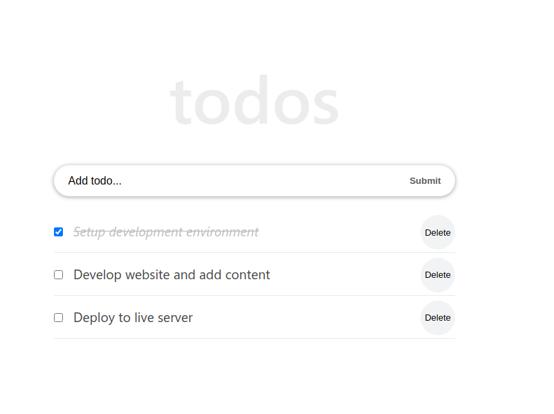

# Todo App

> Based on the React Tutorial From Scratch: A Step-by-Step Guide (2021)

## Live Demo

[Here](https://todo-react-tutorial.surge.sh/)

## Table of Contents

- [Description](#description)
- [Built With](#built-with)
- [Getting Started](#getting-started)
  - [Setup](#setup)
- [Scripts](#scripts)
  - [Start dev server](#start-dev-server)
  - [Build for production](#Build-for-production)
  - [Locally preview production build](#Locally-preview-production-build)
- [Show Your Support](#how-your-support)
- [Acknowledgments](#acknowledgments)
- [License](#license)

## Description

This is the implementation of the app described by the [React Tutorial From Scratch](https://ibaslogic.com/react-tutorial-for-beginners/)
by [ibaslogic.com](https://ibaslogic.com/).

- Make simple calculations.
- Read a random math-related quote.

## Built With

- [React](https://vitejs.dev/) A JavaScript library for building user interfaces.
- [ViteJs](https://vitejs.dev/) Next Generation Frontend Tooling.
- [react-router](https://reactrouter.com/) A declarative library for building single page applications.
- [Babel 7](https://github.com/babel/babel) (`@babel/core`) - JavaScript compiler - _Use next generation JavaScript, today._

## Getting Started

To get a local copy up and running follow these simple example steps.

### Prerequisites

- `node` : `^12 || >=14`
- `npm` or `yarn`

### Setup

1. Download or fork this project
2. Extract the content to a new directory, rename it and cd the directory.
3. Install all dependencies using:

- `npm install` or `yarn`

## Scripts

### Start dev server

- `npm run dev` or `yarn run dev` and open the browser at `http://localhost:3000`

### Build for production

- `npm run build` or `yarn run build`

### Locally preview production build

After creating the production build, run:

- `npm run preview` or `yarn run preview` and open the browser at `http://localhost:5000`

## Connect With Me

- GitHub: [@fabgrel10](https://github.com/fabgrel10)
- Twitter: [@fabgrel10](https://twitter.com/fabgrel10)
- LinkedIn: [@fabgrel10](https://www.linkedin.com/in/fabgrel10/)

## Show your support

Give a ⭐️ if you like this project!

## Acknowledgments

You can follow the find the React Tutorial From Scratch: A Step-by-Step Guide (2021) here:

- https://ibaslogic.com/react-tutorial-for-beginners/

## License

No license. Feel free to use it for whatever you need.
